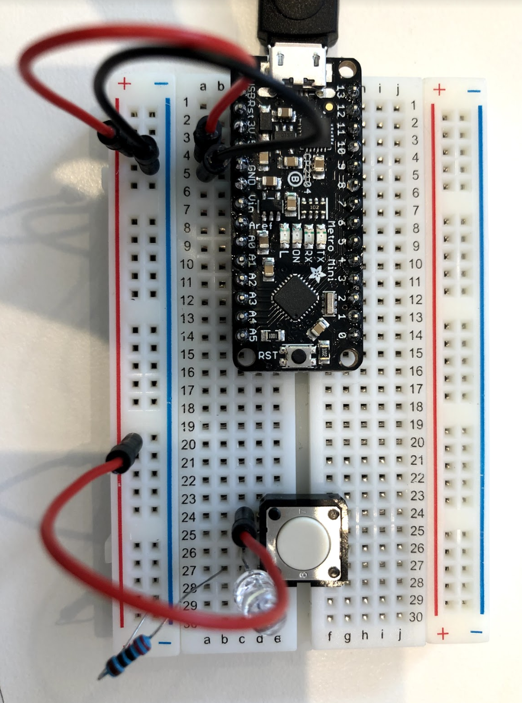
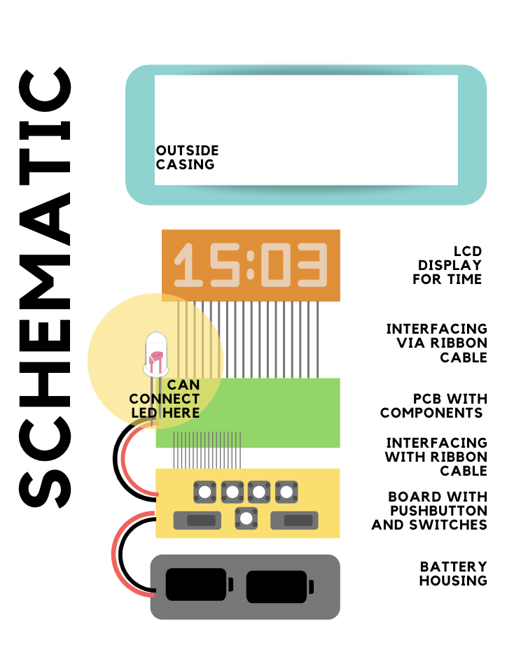
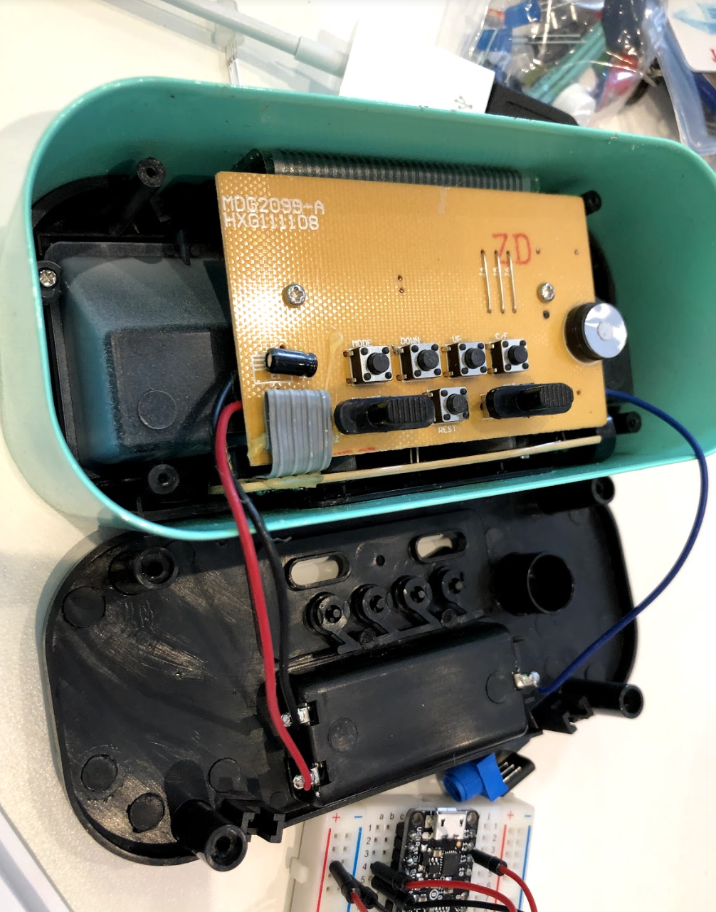
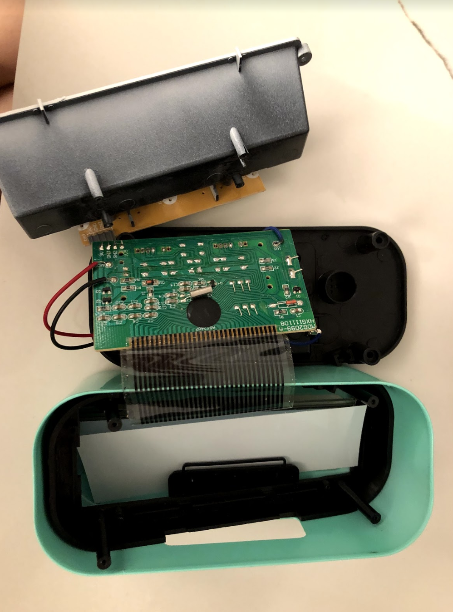

# IDD-Fa18-Lab1: Blink!

**A lab report by Lois Lee**

## Part A. Set Up a Breadboard



## Part B. Manually Blink a LED

**a. What color stripes are on a 100 Ohm resistor?**
Brown, Black, Brown, Gold
 
**b. What do you have to do to light your LED?**
Hook the pushbutton up to power, put the positive end of the LED to the other end of the pushbutton, attach the 100 ohm resistor from the remaining end of the LED to ground. Push the button to connect the LED to the power source.


## Part C. Blink a LED using Arduino

### 1. Blink the on-board LED

**a. What line(s) of code do you need to change to make the LED blink (like, at all)?**

The onboard LED does not require any changes to blink.

For the external LED to blink, in the setup, the output LED is currently the builtin LED which can be seen in : `pinMode(LED_BUILTIN, OUTPUT);` what we want to do is change that to a pin that we've connected the LED to. For example, if pin 13, `pinMode(13, OUTPUT);`

**b. What line(s) of code do you need to change the rate of blinking?**

The following code is what is in the loop. The `delay(1000)` show that the arduino is blinking every 1 second. We can simply change the 1000 value to change the rate of blinking. 
```
void loop() {
  digitalWrite(LED_BUILTIN, HIGH);   // turn the LED on (HIGH is the voltage level)
  delay(1000);                       // wait for a second
  digitalWrite(LED_BUILTIN, LOW);    // turn the LED off by making the voltage LOW
  delay(1000);                       // wait for a second
}
```

**c. What circuit element would you want to add to protect the board and external LED?**
A resistor, just to prevent potential short circuiting.
 
**d. At what delay can you no longer *perceive* the LED blinking? How can you prove to yourself that it is, in fact, still blinking?**
0.013 is how long researchers at MIT say it takes for the human brain to process entire images, so when the delay is 10, or .010 seconds, it makes it hard for us to detect the rapid change.


**e. Modify the code to make your LED blink your way. Save your new blink code to your lab 1 repository, with a link on the README.md.**

[My Blink Code](https://github.com/lois-lee/IDD-Fa18-Lab1/blob/master/MyBlink.ino)


### 2. Blink your LED

**Make a video of your LED blinking, and add it to your lab submission.**

[LED blinking](https://drive.google.com/file/d/1nXiCv9YYWKr9BmmJ-nfA2-L4aBHzRMnS/view?usp=sharing)


## Part D. Manually fade an LED

**a. Are you able to get the LED to glow the whole turning range of the potentiometer? Why or why not?**
Yes, it turns all the way up to max brightness and appears to turn completely off.
[LED manual fade](https://drive.google.com/file/d/12xLlLHafHWOsWVopC1y5T6NMDKHF5ro0/view?usp=sharing)


## Part E. Fade an LED using Arduino

**a. What do you have to modify to make the code control the circuit you've built on your breadboard?**

Change the led variable to `int led = 11;` 

**b. What is analogWrite()? How is that different than digitalWrite()?**
analogWrite() allows us to write a range of voltages rather than just 0 and 5V.


## Part F. FRANKENLIGHT!!!

### 1. Take apart your electronic device, and draw a schematic of what is inside. 

Schematic:


**a. Is there computation in your device? Where is it? What do you think is happening inside the "computer?"**
I think the buttons change the display and the internal clock to keep time and change time. The toggling switches turn on the alarm.

**b. Are there sensors on your device? How do they work? How is the sensed information conveyed to other portions of the device?**
No, there are no sensors, just buttons.

**c. How is the device powered? Is there any transformation or regulation of the power? How is that done? What voltages are used throughout the system?**
There are batteries that you add in. There are capacitors within the system.

**d. Is information stored in your device? Where? How?**
Yes, in a separate board with memory.

### 2. Using your schematic, figure out where a good point would be to hijack your device and implant an LED.
The point where the batteries hooked up to the actual device.

Here is what the inside of my alarm clock looks like:



I simply attached the LED to the inside where the battery cartidge has power and ground, like in the following video:

### 3. Build your light!


[Video for Frankenlight!](https://drive.google.com/file/d/1Yx2mS5HPDpjrjWzozuDM8Im8mDvhUE36/view?usp=sharing)


